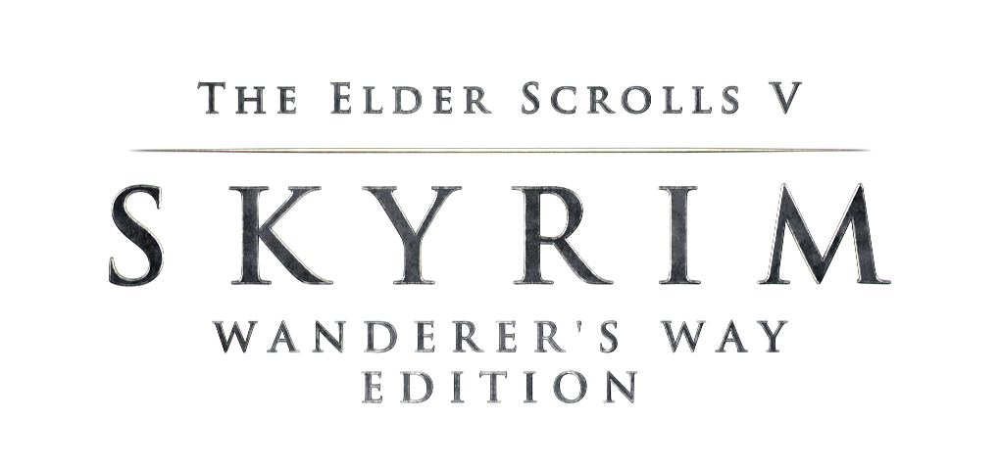

# Wanderer's Way
A Community Shaders based Skyrim modlist focused on Exploration, Roleplay, Player Choice and a Dynamic World.

**Links**: [Nexus Page](https://www.nexusmods.com/skyrimspecialedition/mods/163526) | [Changelog](https://github.com/Kekistann/WanderersWay/blob/main/changelog.md) | [Load Order](https://loadorderlibrary.com/lists/wanderer-s-way-2)

**Requirements**:
- Skyrim version 1.6.1170 (latest Steam update).
- Skyrim AE with all Anniversary Edition content (Paid Creation Content).

## System Requirements
- **OS**: Windows 10 or 11 (no LTSC or modified versions; Linux not supported).
- **Storage**: SSD required.
- **Download Size**: ~x.
- **Install Size**: ~x.

| Component | Minimum (1080p Native 60FPS)  | Recommended (1440p Native 60FPS) |
|-----------|-------------------------------|----------------------------------|
| CPU       | i5-12600k / AMD Ryzen 5 5600X | i5-13600K / AMD Ryzen 5 7600X    |
| GPU       | RTX 3070 / AMD RX 6800 XT     | RTX 4070 / AMD RX 7800 XT        |
| RAM       | 16GB DDR4                     | 32GB DDR4                        |
| Storage   | SATA SSD                      | NVMe SSD                         |

The specs above reflect native performance. I highly recommend enabling Upscaling at a minimum, with Frame Generation or AMD FSR 3.1 enabled if your hardware supports it. Both are provided by Community Shaders and are pre-configured in the list. Together, they can effectively double your framerate with minimal visual impact.

---

## Installation

### Pre-Installation
1. **Dependencies**:
   - [Visual C++ x64](https://aka.ms/vs/17/release/vc_redist.x64.exe).
   - [.NET Runtime 8.x.x Desktop x64](https://dotnet.microsoft.com/en-us/download/dotnet/thank-you/runtime-desktop-8.0.15-windows-x64-installer).
   - [.NET Runtime 6.0.0 Desktop x64](https://dotnet.microsoft.com/en-us/download/dotnet/thank-you/runtime-desktop-6.0.30-windows-x64-installer).
   - If Visual C++ is installed, use the `Repair` option.

2. **Steam Setup**:

   Wanderer's Way will only work with the Steam version of Skyrim. Additionally, it will only work with English versions of the game.
   
   - Install Skyrim into a location that is not Program Files.
   - Right click Skyrim in Steam, click `Properties`, disable `Enable the Steam overlay while in-game`.
   - Disable [auto-updates for Skyrim AE](https://help.steampowered.com/en/faqs/view/71AB-698D-57EB-178C#disable).
   - Launch the game from Steam, and ignore any pop-ups about settings in the launcher.
   - Once at the Title Screen, you should receive a prompt to download all CC content. Accept it. Do not ALT+Tab during this process.
   - When complete, close Skyrim.
  
If you have not bought the Anniversary Edition DLC before, please do so. The list will not install without it. 

> [!WARNING]
> You should not verify file integrity through Steam. This will cause the wrong version of the Rare Curios creation to download, causing the installation to fail.
  
   A non-English version of the game will cause problems later. To verify that your game is in English, please perform the following steps:
   - Right click on Skyrim in Steam
   - Click `Properties`
   - Under `General`, set `Language` to `English`

> [!WARNING]
> If your Steam library is in Program Files, refer to [this](https://github.com/LostDragonist/steam-library-setup-tool/wiki/Usage-Guide) guide to move it elsewhere. Do not install Skyrim to default Windows folders (Desktop, Documents, Downloads, etc.) as this will cause issues.

> [!CAUTION]
> There is no workaround for a pirated copy of Skyrim or pirated Creation Club content. Don't bother.
  
3. **PageFile and Crash Prevention**:

   Larger modlists tend to require a lot of memory. If there isn't enough memory, the game might fail to allocate more and cause a memory-related crash. You can fix this with a pagefile, which essentially acts as virtual memory. To prevent memory crashes, perform the following steps to increase your pagefile size:
     
   - Press `Win + R` and enter `sysdm.cpl ,3`
   - Under the `Advanced` tab, press `Settings` under the `Performance` section
   - In the window that pops up, go to the `Advanced` tab and press `Change...` under the `Virtual Memory` section
   - Disable `Automatically manage paging file size for all drives`
   - Select your disk drive, ideally your fasted SSD
   - Under the `Custom Size:` option, change `Initial Size (MB)` and `Maximum Size (MB)` to `20480`
   - Click `Set`
   - Click `OK`, then `Apply` and `OK`
   - Restart your computer

### Wabbajack Installation
1. **Install Wabbajack**:
   - Create a folder (e.g., `C:\Wabbajack`) on your drive’s root (not in Program Files, Desktop, etc.).
   - Download [Wabbajack](https://github.com/wabbajack-tools/wabbajack/releases/latest/download/Wabbajack.exe) and place it in the folder.
   - Run `Wabbajack.exe` (requires version 4.0.0.0 or later).
  
2. **Install Wanderer's Way**:
   - Open Wabbajack, select Skyrim AE, search Wanderer's Way, and click “Download and Install.”
   - Set Installation Location (e.g., `C:\Wanderer's Way`) and Downloads Location (avoid Program Files, Desktop, etc.).
   - Click Install.
   - Nexus Premium automates downloads; without it, manually click “Slow Download” for each mod.
  
---
## Playing Wanderer's Way
- Launch Skyrim SE through Mod Organizer 2 (MO2) in the Wanderer's Way folder.
- After character creation, a notification will pop-up stating Wanderer's Way is configuring. Stand still and wait for configuration to complete. Upon completion, you will receive a second notification stating you're good to go.
- Wanderer's Way is pre-configured on Adept difficulty and intended to be played this way. Increasing or decreasing the difficulty slider will heavily alter your experience.
- After character creation and game configuration is finished, follow the quest markers to gear up/choose your background. Once finished, interact with the Shrine of Akatosh to choose your Game Start. Lastly, exit the room and enjoy your time playing Wanderer's Way!

## Uninstalling
- Delete the Wanderer's Way folder.

---

## Troubleshooting
- **Installation Issues**:
  - Missing files? Manually download and place them in the Downloads folder.
  - Game folder not found? Ensure Skyrim SE is installed and follow [Pre-Installation](#pre-installation).
  - Antivirus flagging? Add exceptions or uninstall aggressive third-party AV (e.g., Norton).

- **Post-Installation Issues**:
  - Form 43/DLL errors? Reinstall with “Overwrite Installation” checked in Wabbajack.
